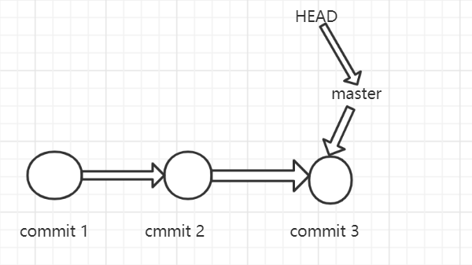
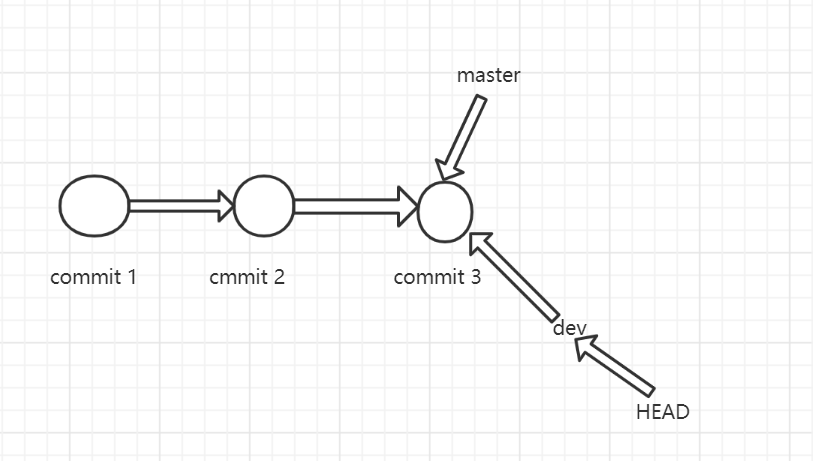
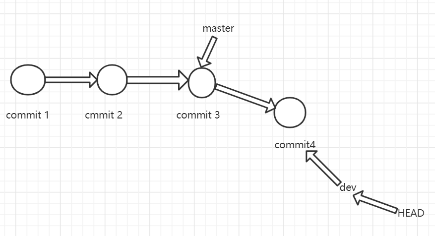
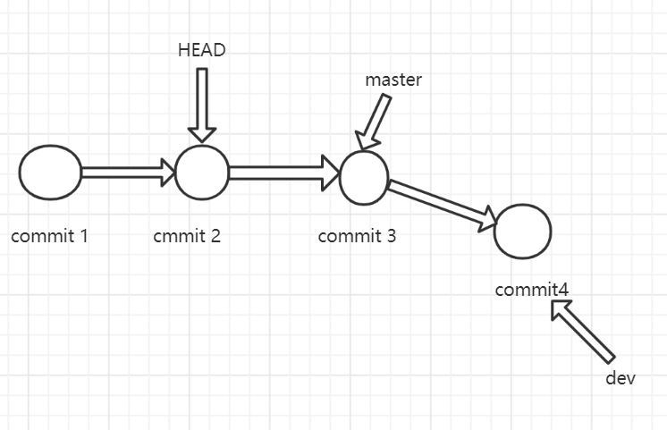

## Hey
>git学习篇(8)

上篇文章中，我有提到过一嘴"Git分离头指针"的概念，相信大家可能会好奇，git的分离头指针，它究竟是个啥呢？为什么要设计这样一个功能？它怎么使用？又有哪些使用场景呢？
别急，且听我娓娓道来。

在实际开发中，我们一般以master作为主分支，用来生产环境的测试和发布使用。随着代码的提交，master的时间线可能是长这样子



我们可以看到在master分支上，有3次提交，master当前指向的是commit3这次提交。HEAD指针表示当前指向的分支是谁，它现在指向了master，也指向了commit3这次提交。
commit其实是某次提交的文件快照，git是基于提交的，我们可以用`git cat-file -t commit_id`(Git为标识每次提交产生的40位经过SHA1加密过之后的HASH值)，
来查看commit_id所属的对象类型，使用`git cat-file -p commit_id`来查看每个对象的内容和简单的数据结构。git主要有四种对象类型，Blog,Tree,Commit,Tag,他们都是用SHA1计算出来的HASH值进行命名。

`git cat-file`是git的瑞士军刀，是底层的核心命令。

回到主题，假设现在我们使用`git checkout -b dev`命令，创建了dev分支并切换，时间线会变成这样



可以看到，HEAD指向的是dev分支，他们也都指向了commit3这次提交，现在如果在dev分支上继续开发，并且有一次提交，git的时间线变化如下



由于没有合并，master分支还是停留在了commit3这个提交,dev分支已经超前了一次提交。

那究竟什么是分离头指针呢，它指的是HEAD不指向任何分支，而指向某次提交。我们用`git checkout commit2`,来分离头指针，指向commit2这次提交，现在git时间线模式如下




这个时候git会在终端提示(以我电脑输出为例)
```
git checkout 58df8b3
Note: checking out '58df8b3'.

You are in 'detached HEAD' state. You can look around, make experimental
changes and commit them, and you can discard any commits you make in this
state without impacting any branches by performing another checkout.

If you want to create a new branch to retain commits you create, you may
do so (now or later) by using -b with the checkout command again. Example:

  git checkout -b <new-branch-name>

HEAD is now at 58df8b3 Update 2020-04-11-Git分支操作命令.md
```
